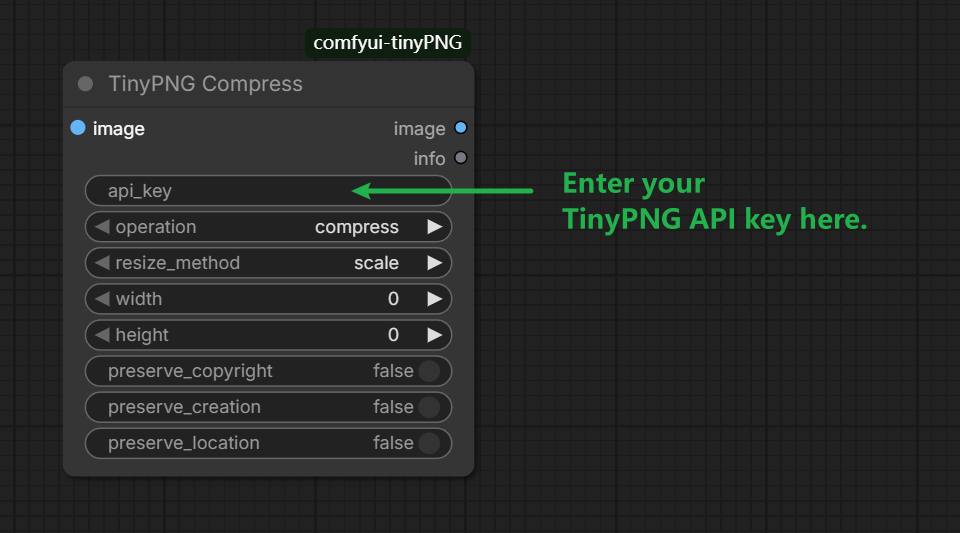

# ComfyUI TinyPNG

Language / 语言: [English](./README.md) | [中文](./README_zh.md)

A ComfyUI custom node for compressing images via the TinyPNG API.

## Features

- Compress image batches in ComfyUI (`IMAGE`)
- TinyPNG smart resize methods: `scale`, `fit`, `cover`, `thumb`
- Optional metadata preserve: `copyright`, `creation`, `location`
- Returns compression stats text (`info`)

## Installation

### Install with ComfyUI Manager

1. Open `ComfyUI Manager` -> `Extension Manager`.
2. Search `ComfyUI TinyPNG` or `comfyui-tinypng`.
3. Install and restart ComfyUI.

### Manual install

```bash
cd ComfyUI/custom_nodes
git clone https://github.com/knottttt/comfyui-tinyPNG.git
cd comfyui-tinyPNG
pip install -r requirements.txt
```

Restart ComfyUI.

## Usage

- Add node: `TinyPNG Compress`
- Required: TinyPNG API key from <https://tinypng.com/developers>
- `operation=compress` for compression only
- `operation=smart_resize` with `resize_method` for TinyPNG resizing

## Screenshot



## Acknowledgements

- This project is inspired by and references [TinyGUI](https://github.com/chenjing1294/TinyGUI).

## License

MIT. See [LICENSE](./LICENSE).
